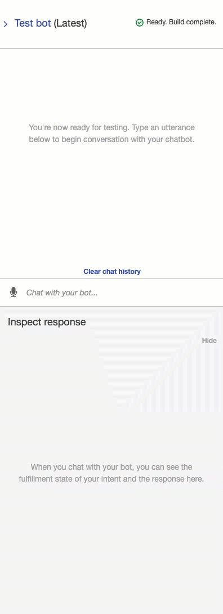
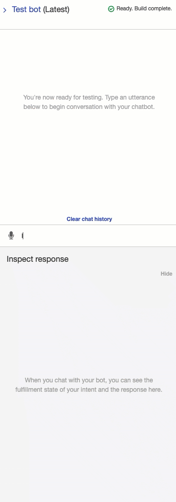
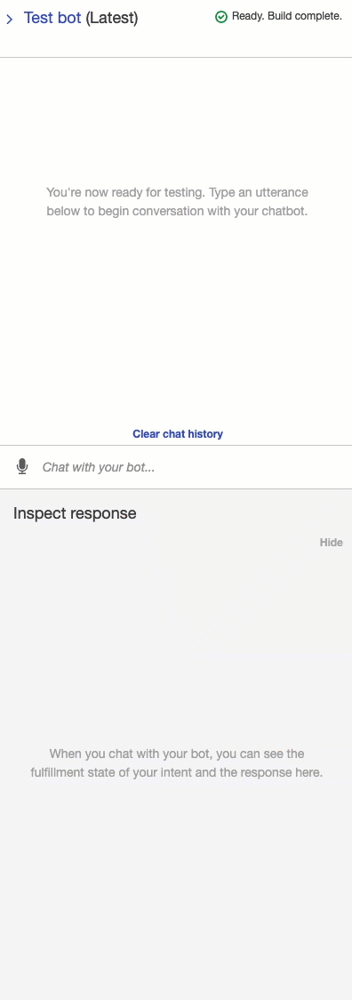
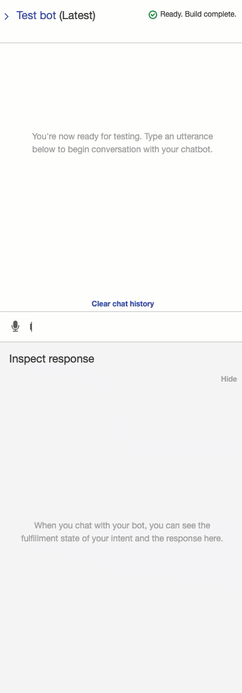

# Robo Advisors


This uses AWS services to create a chatbot that will recommend an investment portfolio for a retirement plan.  Users will communicate through a chatbot and after a few simple questions and with the use of machine learning and NLP, our robo advisor will provide the most suitable retirement plan.

To use the robo advisor, use ```lambda_function.py``` in Lambda folder.

---
## AWS Services

This was written in Python 3.7 on a Jupyter Notebook.

List of Services:
* Amazon Simple Storage Service (Amazon S3)
* Amazon Lex
* Amazon Lambda
* AWS Identity and Access Management


---
## Chatbots

|    Chatbot   |         Visualization        |     Description     |
|:-------------------|------------------------------------------------|-------------|
|     Initial Testbot    |        |  This is our initial testbot on Amazon Lex.|
|     Invalid Testbot - Age    |        |  By using Amazon Lambda, we are able to valid a users age.  Here our roboadvisor is able to inform a user that they do not meet the age requirement for our services.|
|     Invalid Testbot - Investment Amount   |        |  By using Amazon Lambda, we are able to valid a users investment amount.  Here our roboadvisor is able to inform a user that they do not meet the minimum $5000 investment.|
|     Working Bot    |        |  This is our final working bot with Amazon Lamda used to validate a user's age and investment amount.|

---
## Contributors
Christina San Diego